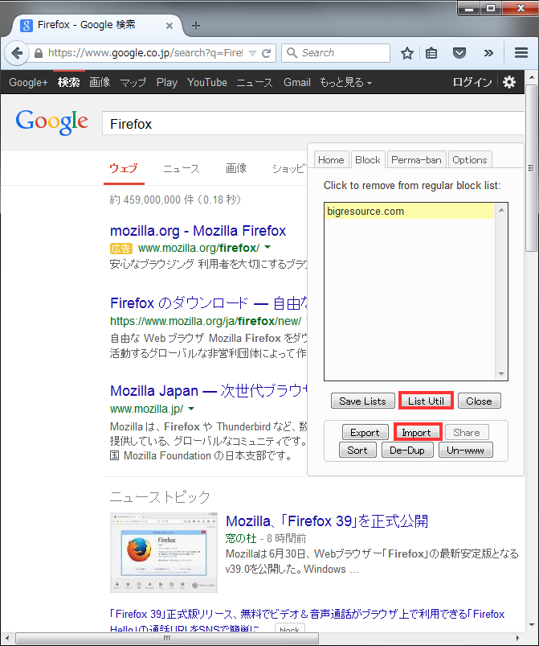
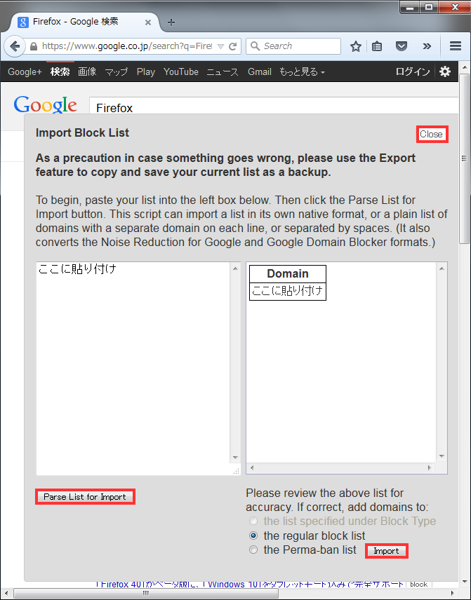
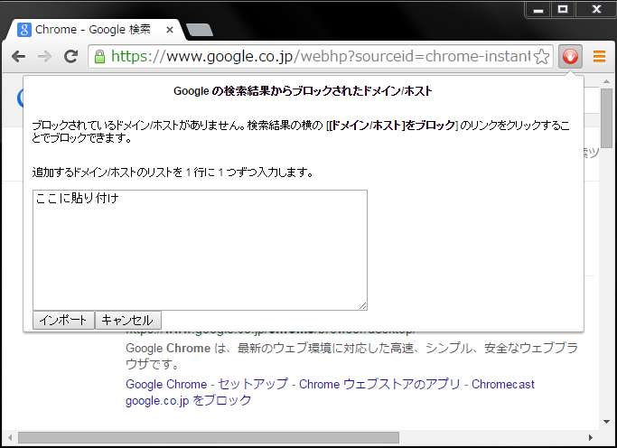
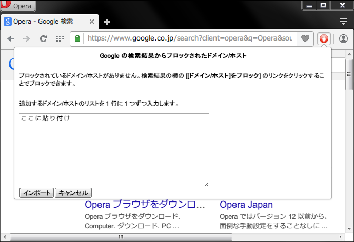
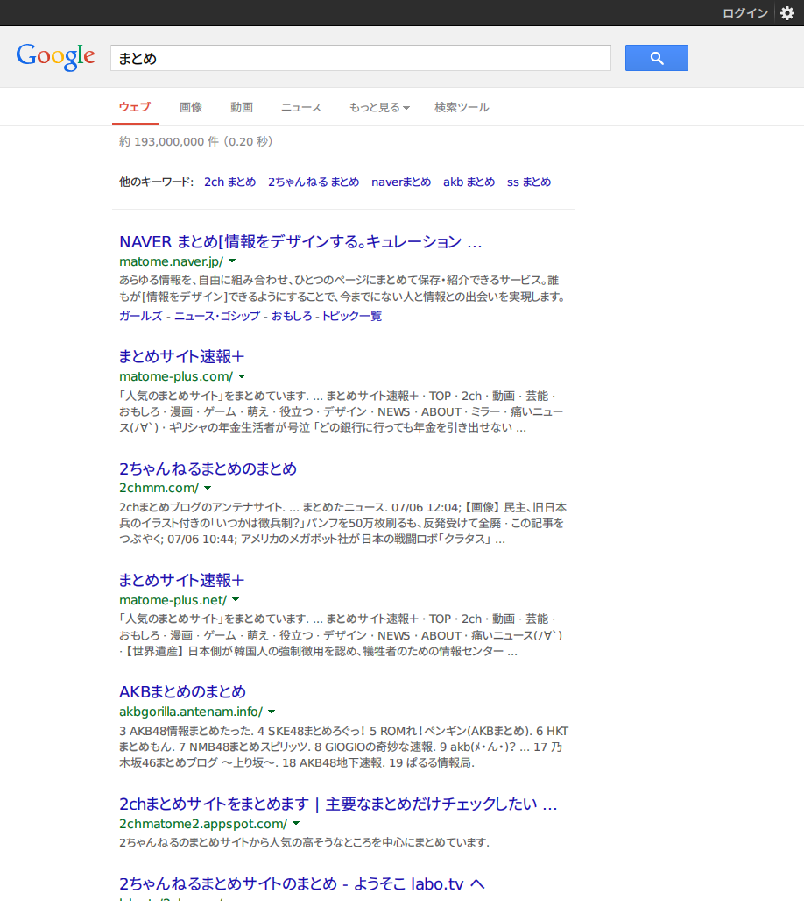
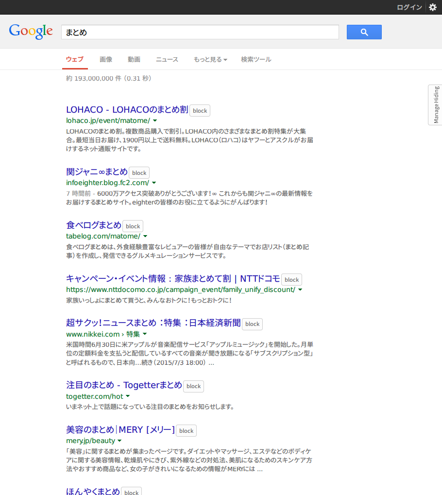

# 検索時に邪魔になるサイトリスト / AdBlock 互換 YouTuber フィルタ / ツイカスフィルタ

* 検索時に邪魔になるサイトのリストです。他には AdBlock 等の広告をブロックするアドオンで  
使用できるフィルタがあります

## 検索時に邪魔になるサイトリストの使い方
ファイルへの直リンク  
[blocklist.txt](https://github.com/umucub/blocklist/raw/master/blocklist.txt)  
[Hide Unwanted Results Data.csv](https://github.com/umucub/blocklist/raw/master/Hide%20Unwanted%20Results%20Data.csv)  

データベースファイル
https://github.com/umucub/blocklist/raw/master/db

### データベースファイルの使い方  
**※※※上書きする際はブラウザを閉じてからしてください※※※**  
**※※※設定等は上書きされるので注意してください※※※**

* Personal Blocklist の場合  
    chrome-extension_nolijncfnkgaikbjbdaogikpmpbdcdef_0.localstorage  
    をプロファイルフォルダ内の Local Storage フォルダへ上書き保存

* Google Hit Hider by Domain の場合  
    Google_Hit_Hider_by_Domain_(Search_Filter_Block_Sites).db.block  
    または  
    Google_Hit_Hider_by_Domain_(Search_Filter_Block_Sites).db.perma  
    どちらかを Google_Hit_Hider_by_Domain_(Search_Filter_Block_Sites).db にリネームした後  
    プロファイルフォルダ内の gm_scripts フォルダへ上書き保存  
    (.block と .perma の違いは、削除されたかどうかの通知があるかないか)

**※このリストを使用すると検索結果の表示件数が少なくなるので、検索エンジンの設定で件数を多くした方がいいかもしれません**  
[Google の設定ページ](https://www.google.co.jp/preferences)

ページ内リンク  
[Firefox](#firefox) [Chrome](#chrome) [Opera (15+)](#opera-15) [Opera 12 (Presto)](#opera-12-presto) 
[Vivaldi](#vivaldi) [その他のブラウザ](#%E3%81%9D%E3%81%AE%E4%BB%96%E3%81%AE%E3%83%96%E3%83%A9%E3%82%A6%E3%82%B6)  
[Android](#android)  
[Youtuber フィルタ](#adblock-%E4%BA%92%E6%8F%9B-youtuber-%E3%83%95%E3%82%A3%E3%83%AB%E3%82%BF)
 [ツイカスフィルタ](#adblock-%E4%BA%92%E6%8F%9B-%E3%83%84%E3%82%A4%E3%82%AB%E3%82%B9-%E3%83%95%E3%82%A3%E3%83%AB%E3%82%BF)

### Firefox
[Hide Unwanted Results of Google Search](https://addons.mozilla.org/ja/firefox/addon/hide-unwanted-results-of-go/)
をインストール

または

[GreaseMonkey](https://addons.mozilla.org/ja/firefox/addon/greasemonkey/)
\+
[Google Hit Hider by Domain](https://greasyfork.org/ja/scripts/1682-google-hit-hider-by-domain-search-filter-block-sites)
をインストール

#### Hide Unwanted Results of Google Search の場合
1. アドオンメニューを開き、 Hide Unwanted Results of Google Search の設定画面を開く
2. Import... と書いてあるボタンをクリックして、 Hide Unwanted Results Data.csv をインポート

**インポートがうまくいかない場合は、 `about:config` から 設定名: `extensions.jid0-TpZJ4wPImlT1zIqfw58bD9vOeWQ@jetpack.unwantedSites`  
を探してドメインを半角スペース区切りで追加してみてください**

#### Google Hit Hider by Domain の場合
1. Google で適当な語句を検索
2. 検索結果のページ右側に Manage Hiding と書かれたボタンがあるのでクリック  

3. 下部の List Util ボタンをクリックしたあと Import ボタンをクリック  

4. blocklist.txt をコピペして the regular block list または the Perma-ban list をチェックして Parse List for Import ボタンをクリック  
 (Block と Perma-ban の違いは削除されたかどうかの通知があるかないか)
5. Import ボタンをクリックして右上の Close ボタンで閉じる (途中に出てくるポップアップは OK をクリック)  

### Chrome
[Personal Blocklist](https://chrome.google.com/webstore/detail/personal-blocklist-by-goo/nolijncfnkgaikbjbdaogikpmpbdcdef)
をインストール

1. 右上の手のひらアイコンをクリックしてインポートをクリック
2. blocklist.txt をコピペしてインポートをクリック  

### Opera (15+)
[Download Chrome Extension](https://addons.opera.com/ja/extensions/details/download-chrome-extension-9/)
をインストールしたあと、
[Personal Blocklist](https://chrome.google.com/webstore/detail/personal-blocklist-by-goo/nolijncfnkgaikbjbdaogikpmpbdcdef)
をインストール

1. 右上の手のひらアイコンをクリックしてインポートをクリック
2. blocklist.txt をコピペしてインポートをクリック  

### Opera 12 (Presto)
[ViolentMonkey](https://addons.opera.com/en/extensions/details/violent-monkey/)
をインストールしたあと、
[Google Hit Hider by Domain](https://greasyfork.org/ja/scripts/1682-google-hit-hider-by-domain-search-filter-block-sites)
をインストール

1. ロケーションバーに opera:config と入力して設定ファイルエディタを開く
2. 検索ボックスに Custom User-Agent と入力して出てきたボックスに  
`Mozilla/5.0 (Windows NT 6.1; WOW64; rv:39.0) Gecko/20100101 Firefox/39.0` 等のユーザーエージェントを入力する
3. その後は Firefox の Google Hit Hider by Domain を使う方法と同じ

### Vivaldi
[Personal Blocklist](https://chrome.google.com/webstore/detail/personal-blocklist-by-goo/nolijncfnkgaikbjbdaogikpmpbdcdef)
をインストール

1. URL バーに chrome-extension://nolijncfnkgaikbjbdaogikpmpbdcdef/manager.html と入力  
その後は Chrome と同じ

### その他のブラウザ
#### Safari
Tampermonkey \+ Google Hit Hider by Domain が使えるかもしれません

## Android
### デフォルトブラウザ
[Tampermonkey](https://play.google.com/store/apps/details?id=net.biniok.tampermonkey)
をインストールして、
[Google Hit Hider by Domain](https://greasyfork.org/ja/scripts/1682-google-hit-hider-by-domain-search-filter-block-sites)
をインストール

あとは PC バージョンの Firefox の説明と同じ

### Dolphin Browser
[TampermonkeyDolphin](https://play.google.com/store/apps/details?id=net.tampermonkey.dolphin)
をインストールして、
[Google Hit Hider by Domain](https://greasyfork.org/ja/scripts/1682-google-hit-hider-by-domain-search-filter-block-sites)
をインストール

あとは PC バージョンの Firefox の説明と同じ

## スクリーンショット (Google Hit Hider by Domain を使用)
使用前  

使用後  

## ライセンス
パブリックドメイン

***

# AdBlock 互換 YouTuber フィルタ
購読用リンク: https://github.com/umucub/blocklist/raw/master/youtuber.txt

## ライセンス
パブリックドメイン

***

# AdBlock 互換 ツイカス フィルタ
購読用リンク: https://github.com/umucub/blocklist/raw/master/twikasu.txt

## ライセンス
パブリックドメイン

***

# 連絡先等
tanasinn@mail.ru

誤爆してたり追加したほうがいいサイトがあれば Issues かメールか嫌儲のそれっぽいスレにでも書いておいてください
